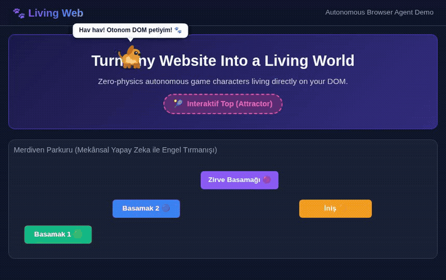

<div align="center">

# 🐾 Living Web (`@living-web/sdk`)

**Turn any website into a living, interactive world with autonomous browser agents.**

[](https://github.com/kadiryildiz283/live-pet/actions)
[](https://www.gnu.org/licenses/gpl-3.0)
[](https://www.typescriptlang.org/)
[](https://vitest.dev/)
[](#)
[](CONTRIBUTING.md)

<br/>



<br/>
<br/>

> **"The user defines the character; Living Web defines the world."**

</div>

---

## 🌟 What is Living Web?

**Living Web** is an open-source browser runtime that places user-defined animated characters inside ordinary HTML pages and makes them behave like autonomous, physics-aware game agents.

You don't need to implement game loops, gravity, collision detection, sprite timing, or scroll mapping. The runtime scans your DOM geometry, converts headers, cards, and buttons into physical platforms, and runs simulation and utility-driven behavior automatically.

---

## ✨ Features

- ⚡ **Zero-Physics Developer Experience**: No manual gravity equations, coordinate tracking, or collision loops.
- 🔍 **Automatic World Discovery**: Automatically turns semantic HTML (`header`, `main`, `section`, `button`, `.card`, etc.) into physical platforms with debounced `MutationObserver` & `ResizeObserver` tracking.
- 🧠 **Personality-Driven Utility AI**: Local finite-state machine (`IDLE`, `WALK`, `RUN`, `JUMP`, `FALL`, `CLIMB`, `BARK`, `SLEEP`, `OBSERVE`, `INTERACT`) driven by energy, curiosity, friendliness, and boredom.
- 🎯 **Declarative HTML Hints**: Customize the world with simple HTML attributes (`data-living-platform`, `data-living-attractor`, `data-living-ignore`).
- 🎨 **High-DPI Canvas Overlay**: Smooth 60 FPS hardware-accelerated rendering with procedural pixel graphics, sprite asset support, and XSS-sanitized speech bubbles.
- 🖱️ **Interactive Signals**: Pointer hover, drag-and-drop, clicks, and page scroll synchronization.
- 🔒 **Privacy & Offline First**: 100% browser-authoritative real-time simulation; cloud AI is optional and low-frequency.

---

## 🚀 Quick Start

### 1. Installation

```bash
npm install @living-web/sdk
```

Or load via script tag:

```html
<script src="dist/living-web.global.js"></script>
```

---

### 2. Basic Usage (Vanilla JavaScript / TypeScript)

```typescript
import { livingPet } from "@living-web/sdk";

// Initialize your pet
const dog = await livingPet({
  name: "Boncuk",
  species: "dog",
  assets: "/pets/boncuk/",
  personality: {
    energy: 0.8,
    curiosity: 0.9,
    friendliness: 1.0,
    playfulness: 0.7
  }
});

// Start roaming the DOM
dog.start();

// Make pet speak or perform actions
dog.say("Hello Living World!");
dog.bark();
dog.jump();
```

---

## 🏷️ Declarative HTML Hints

You can guide the character's world interactions directly in your HTML markup:

```html
<!-- Explicitly mark an element as a solid platform -->
<div class="custom-shelf" data-living-platform>
  Solid Platform
</div>

<!-- Attractor Zone: Pet will be drawn here to play -->
<div class="toy-area" data-living-attractor="squeaky-ball">
  🎾 Toy Box
</div>

<!-- Ignore overlays, ad banners, or modals -->
<div class="cookie-banner" data-living-ignore>
  Do not land here
</div>
```

---

## 🏗️ Architecture

```text
Host Webpage (DOM)
       │
       ▼
┌─────────────────────────────────────────────────────────┐
│                      Living Web SDK                     │
│                                                         │
│  ┌───────────────┐     ┌──────────────┐     ┌────────┐  │
│  │  DOM Scanner  │ ──► │  World Model │ ──► │ Physics│  │
│  └───────────────┘     └──────────────┘     └────┬───┘  │
│                                                  │      │
│  ┌───────────────┐     ┌──────────────┐          │      │
│  │   Behavior    │ ──► │  Animation   │ ◄────────┘      │
│  │ Utility Engine│     │  Controller  │                 │
│  └───────────────┘     └──────┬───────┘                 │
│                               │                         │
│  ┌───────────────┐     ┌──────▼───────┐                 │
│  │ Camera/Scroll │ ──► │CanvasRenderer│                 │
│  └───────────────┘     └──────────────┘                 │
└─────────────────────────────────────────────────────────┘
```

---

## 📖 API Reference

### `livingPet(config: PetConfig): Promise<PetController>`

#### `PetConfig` Options:
| Option | Type | Description |
| :--- | :--- | :--- |
| `name` | `string` | Name of the character (e.g. `"Boncuk"`). |
| `species` | `string` | Species identifier (`"dog"`, `"cat"`, etc.). |
| `assets` | `string \| AssetManifest` | Path or manifest for character animations. |
| `personality` | `PersonalityConfig` | Numerical dimensions (`energy`, `curiosity`, `friendliness`, `playfulness`). |
| `world` | `WorldConfig` | Custom platform and ignored CSS selectors. |
| `behavior` | `BehaviorConfig` | Decision intervals, action cooldowns, remote AI settings. |
| `physics` | `PhysicsConfig` | Gravity, walk speed, jump impulse configurations. |

#### `PetController` Methods:
- `pet.start()`: Initializes and starts the runtime simulation.
- `pet.stop()` / `pet.pause()` / `pet.resume()`: Controls simulation lifecycle.
- `pet.say(text, durationMs)`: Displays a speech bubble above the pet.
- `pet.bark()` / `pet.jump()` / `pet.walk()` / `pet.sleep()`: Triggers specific actions.
- `pet.do(action)`: Dispatches arbitrary state machine transitions.
- `pet.teleport(x, y)`: Instantly repositions the pet in world space.
- `pet.getState()`: Returns an immutable snapshot of `CharacterState`.

---

## 🧪 Testing

Living Web comes with a comprehensive test suite covering physics, collisions, state transitions, utility AI, camera transforms, and DOM scanning:

```bash
# Run unit & integration tests
npm test

# Run tests in watch mode
npm run test:watch

# Generate coverage report
npm run test:coverage
```

---

## 🎮 Running the Local Playground

Experience Living Web on an interactive sample website:

```bash
# 1. Build the distribution
npm run build

# 2. Start local web server
python3 -m http.server 3000

# 3. Open browser at:
# http://localhost:3000/
```

---

## 🗺️ Roadmap

Check out our full development plan in [ROADMAP.md](ROADMAP.md) including:
- **v1.5**: Web Audio sound effects, sprite sheet atlas packer, custom pathfinding.
- **v2.0**: Multi-pet social ecosystems, LLM dialogue generation, WebGPU renderer.
- **v3.0**: Community character marketplace and cross-session persistence.

---

## 🤝 Contributing

We welcome contributions of all kinds! Please review our [Contributing Guidelines](CONTRIBUTING.md) and [Code of Conduct](CODE_OF_CONDUCT.md) before submitting pull requests.

---

## ⚖️ License

Distributed under the **GNU General Public License v3.0 (GPL-3.0)**. See [`LICENSE`](LICENSE) for more information.

<div align="center">
Made with ❤️ by the Living Web Team & Community.
</div>
